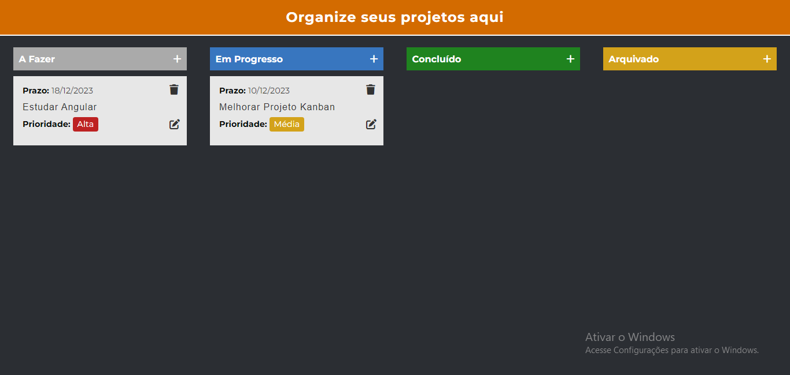

# Projeto KanBan 
Projeto para treinar javascript, pois é um projeto com diversas funcionalidades.

Projeto em fase de criação, vou melhorar diversas coisas e depois de um tempo vou recria-lo em react ou angular.

## Tecnologias 🚀

- HTML
- SASS
- JAVASCRIPT
- CSS

## Design 🎨

## Acesse o projeto pelo link abaixo 🔗
<a href='https://kanban-dev.vercel.app/'>Projeto</a>
